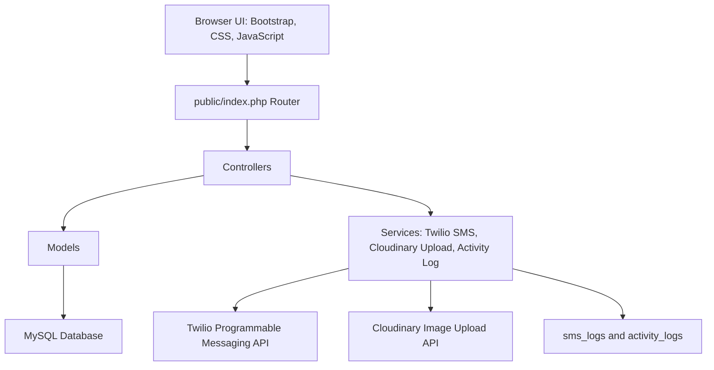

# Project Documentation

## Architecture

The system uses a 3-tier, MVC-like architecture.

## Normalized Database

Main tables:

- `users`: login accounts and roles.
- `categories`: reusable item categories.
- `locations`: reusable campus locations.
- `items`: lost/found reports linked to users, categories, and locations.
- `claims`: ownership claim requests linked to items and users.
- `sms_logs`: sent/failed SMS notification records.
- `activity_logs`: audit trail and recent dashboard activity.

## Requirement Mapping

- Information Management: normalized MySQL schema, CRUD, JOIN queries, search, and filtering.
- SIA: modular 3-tier structure, dashboard reports, Twilio SMS integration, and Cloudinary image API integration.
- IPT2: working PHP web app with Bootstrap UI, JavaScript validation, dark mode, charts, toast notifications, and SMS OTP login verification.
- Project Output: web application files and SQL files in `database/schema.sql` and `database/seed.sql`.

## JOIN Query Examples

The item registry joins `items`, `categories`, `locations`, `users`, and `claims`.

The claims page joins `claims`, `items`, and `users`.

The dashboard joins `categories` with `items` for chart data and `activity_logs` with `users` for recent activity.
